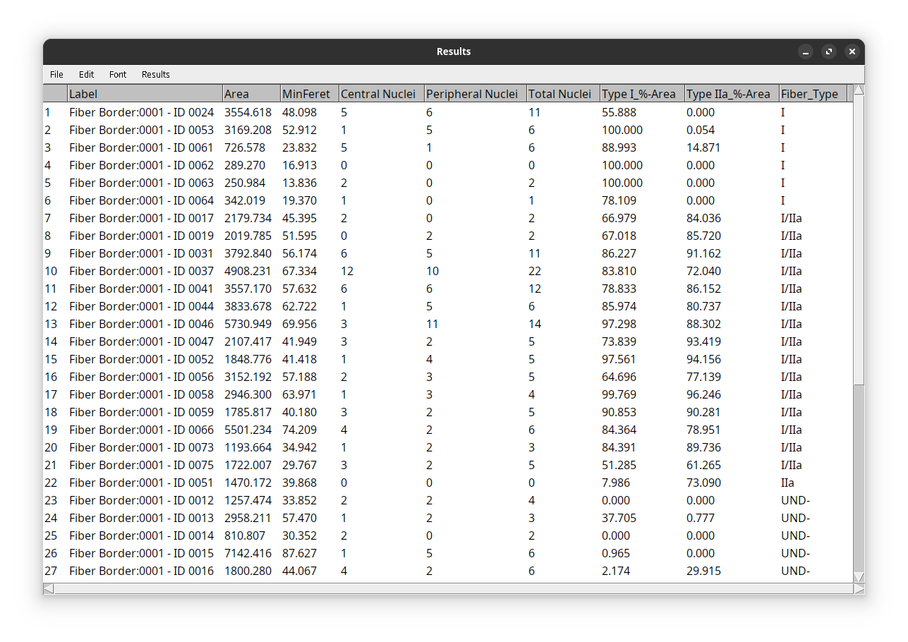
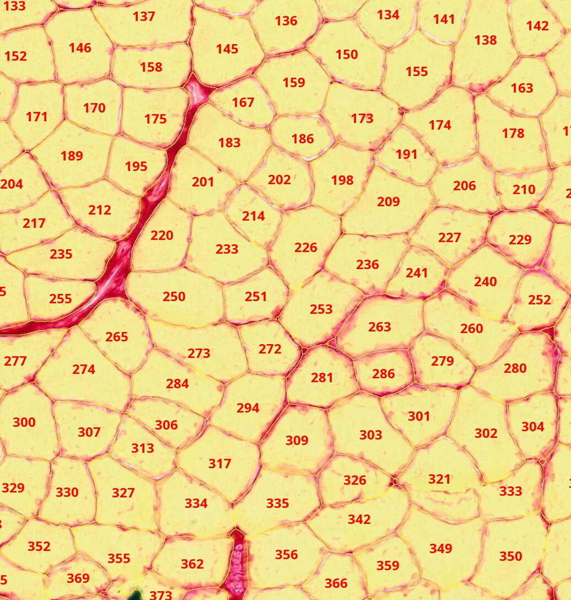
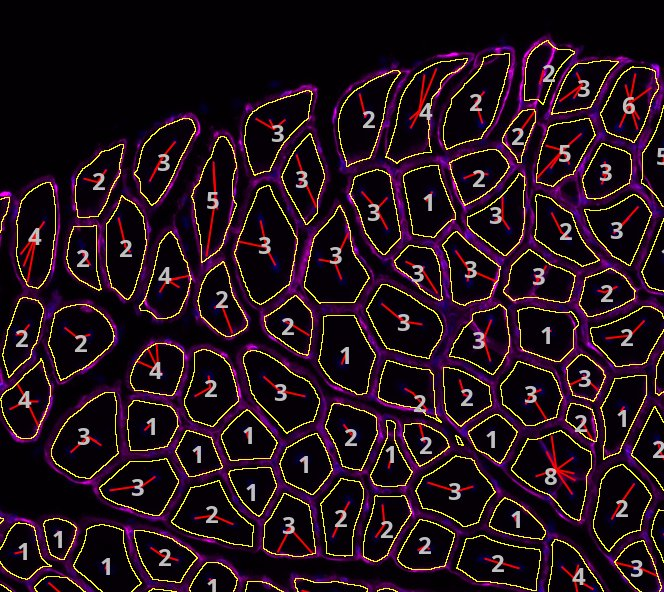
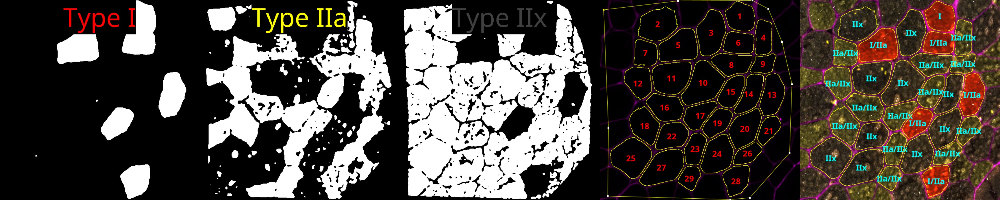
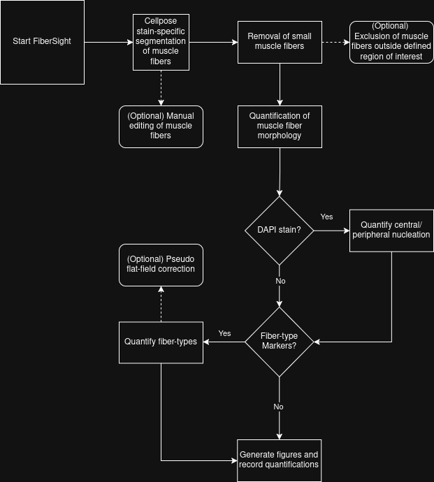

# FiberSight #
FiberSight is an extensible ImageJ/Fiji plugin, designed to generate robust quantifications and visualizations of skeletal muscle images, using custom finetuned [Cellpose](https://github.com/MouseLand/cellpose) models for segmentation, and custom algorithms for estimating morphology, central-nucleation, and fiber-typing.

    

The following three major functionalities are provided:
1) Skeletal muscle fiber morphology (Fiber Feret and Cross-Sectional Area)
2) Skeletal muscle fiber nucleation state (Central/Peripheral/Total nuclei)
3) Skeletal muscle fiber-typing (Type I, IIa, IIx, IIb), as well as hybrid (Type I/IIa, IIa/IIx, IIx/IIb)

## Installation ##
1) Open FIJI, navigate to Help\>Update...
2) Select "Manage Update Sites"
3) Select "Add Unlisted Site", and add the FiberSight update site: https://sites.imagej.net/FiberSight/
4) Then, add the PTBIOP, CLIJ, and CLIJ2 update sites (searachable on the list).
5) Make sure to have [Cellpose](https://github.com/MouseLand/cellpose) installed and working in a conda environment named 'cellpose'.

## Basic Usage ##
From the FIJI top-bar, select FiberSight\>Start FiberSight.

FiberSight requires that you provide the following folder structure for your images.
- experiment\_folder/
  - raw/
    - sampleID1.tif
    - sampleID2.tif
    - ...

Notes:
- The experiment folder can have any name using any valid alphanumeric characters.
- All raw image files should be placed in a subfolder called 'raw'.
- Input images should be in a lossless format, ideally .tif format, or else a standard microscope format (e.g., Nikon and Zeiss tested).
- Figure outputs and results will be saved in the experiment folder.

## Outputs ##

    
     
    <em>(Left) Output results spreadsheet of an image stained with DAPI, Type I, Type IIa, and Laminin (Fiber Border).</em>

    
    
     
    <em>(Left) Morphology of mouse skeletal muscle fibers stained with Picosirius Red and visualized under brightfield.   (Right) Fluorescence image of central nucleation of muscle fibers stained for DAPI (Blue) and Laminin (Magenta). Numbers indicate number of central nuclei.</em>

    
     
    <em>(Left) Whole-slide image of skeletal muscle fibers stained for DAPI (Blue) and Laminin (Magenta).   (Right) Gradient nucleation visualization. Red shows greater central-nucleation and green shows greater peripheral nucleation. </em>

    
     
    <em> Crop of fluorescence human skeletal muscle fibers stained for fiber-types.   Binary thresholds for (Left) Type I, (Left-middle) Type IIa, and (Middle) Type IIx fiber types. (Middle-right) Visualization of fiber morphology. (Right) Composite image showing fiber-types categories. Red: Type I. Yellow: Type IIa. Gray: Type IIx. Magenta: Laminin. </em>

## FiberSight Flow Diagram ##

The process diagram follows this general structure.

  )

# Additional Information #
## Extra Tools ##
Individual tools have been developed to help customize FiberSight to your needs.
1) Cellpose Image allows a user to run Cellpose only on a specific saved image. (saves to sub-folder "cellpose_rois")
2) Edit Fibers allows a user to manually remove errant segmentations. (saves to sub-folder "manually_edited_rois")
3) Draw Border allows a user to draw/edit an ROI border to delineate a region of interest (saves to sub-folder "border_excluded_rois")
4) Exclude Border allows a user to remove fiber ROIs that overlap or are outside of a manually drawn border (saves to sub-folder "border_excluded_rois").

## Batch Mode ##
Each of the tools also has a batch mode equivalent, allowing a user to process a folder of images in succession, as long as the images maintain the same settings.

## Software/Hardware Requirements ##
1) FIJI version 1.54f or higher.
2) BIOP and CLIJ/CLIJ2 update sites enabled.
3) Properly installed conda (Anaconda3 and miniconda3 supported). 
4) Conda environment called 'cellpose' with Cellpose installed in it [(Instructions Here)](https://github.com/BIOP/ijl-utilities-wrappers?tab=readme-ov-file#ia2-conda-installation)
5) A GPU is very helpful for analyzing large whole-slide images

## Advanced Settings ##
Additional options are available too if you select the "Show Advanced Options" checkbox in the FiberSight GUI.
1) Choose whether to exclude small ROIs with an area under 10 pixels.
2) Choose whether to use flat-field correction for an image with variable staining quality.
3) Choose the type of thresholding method used in muscle fiber-typing
4) Choose the pre-set diameter of Cellpose.
5) Choose whether to quantify hybrid muscle fiber-types (I/IIa, IIa/IIx, IIx/IIb)
6) Choose whether to overwrite a previously generated Cellpose segmentation.
