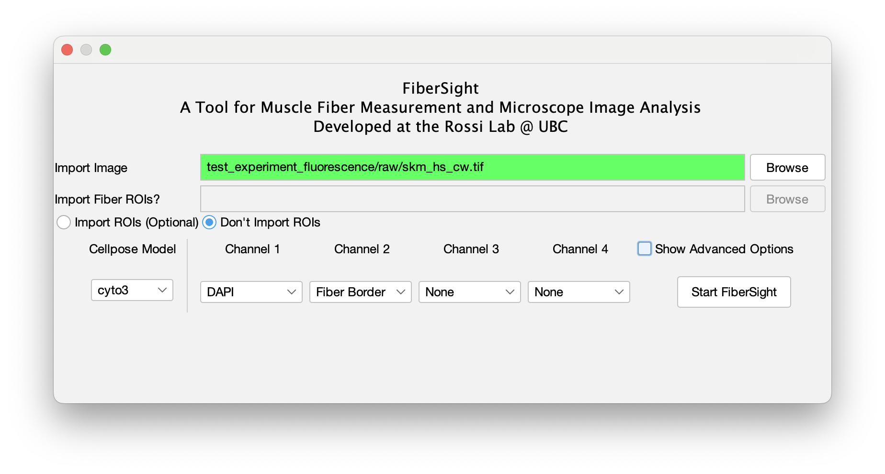

# FiberSight #
FiberSight is an extensible ImageJ/Fiji plugin, designed to generate robust quantifications and visualizations of skeletal muscle images.

The following three major functionalities are provided:
1) Skeletal muscle fiber morphology (Fiber Feret and Cross-Sectional Area)
2) Skeletal muscle fiber nucleation state (Central/Peripheral/Total nuclei)
3) Skeletal muscle fiber-typing (Type I, IIa, IIx, IIb)

# Software Requirements #
1) FIJI version 1.54f or higher.
2) BIOP and CLIJ/CLIJ2 update sites enabled.
3) Properly installed conda (Anaconda3 and miniconda3 supported). 
4) Conda environment called 'cellpose' with Cellpose installed in it [(Instructions Here)](https://github.com/BIOP/ijl-utilities-wrappers?tab=readme-ov-file#ia2-conda-installation)

# Hardware Recommendations #
1) A GPU is very helpful for whole-slide stitched images
2) Mac/Windows/Linux are all supported

# Installation #
1) Open FIJI, navigate to Help\>Update...
2) Select "Manage Update Sites"
3) Select Add Unlisted Site, and add the FiberSight update site: https://sites.imagej.net/FiberSight/
4) Then, add the PTBIOP, CLIJ, and CLIJ2 update sites (searachable on the list).

# Basic Usage #
From the top-bar, select FiberSight\>Start FiberSight.

Input images should be in a lossless format, ideally .tif format, or else a standard microscope format (.nd2 and .czi files supported).

FiberSight requires that you provide the following folder structure for your images.
- experiment\_folder/
  - raw/
    - sampleID1.tif
    - sampleID2.tif
    - ...

Notes:
- The experiment folder can have any name using any valid alphanumeric characters.
- All raw image files should be placed in a subfolder called 'raw'.

A number of options can be set, including:
- Selection of channels and stains (Necessary)
- Whether to import pre-existing fiber ROIs (Optional).
- Choice of Cellpose model (Automatically used if fiber ROIs are not imported)

# Advanced Usage #
Additional options are available too if you select the Advanced options checkbox.
1) Choose whether to exclude small ROIs with an area under 10 pixels.
2) Choose whether to use flat-field correction for an image with variable staining quality.
3) Choose the type of thresholding method used in muscle fiber-typing
4) Choose the pre-set diameter of Cellpose.
5) Choose whether to quantify hybrid muscle fiber-types (I/IIa, IIa/IIx, IIx/IIb)
6) Choose whether to overwrite a previously generated Cellpose segmentation.

# Outputs #

*Output morphological image, muscle fibers highlighted in red*

*Centronucleation image. Positions of nuclei are indicated with red lines, central nucleation region indicated by yellow border*

*Gradient nucleation image. Increasing red: More centrally nucleated. Increasing green: More peripherally nucleated. 

*FiberSight categorizes muscle fibers from multiple thresholded fluorescence signals into specific categorizations.

FiberSight then executes a series of operations to determine each skeletal muscle fiber's morphology, nucleation state, and/or fiber type. Roughly, the following steps are taken in this order:
1) Opens the input image channels and assign them accordingly
2) Performs fiber segmentation using either a prebuilt or finetuned Cellpose skeletal muscle model (or loads a pre-existing segmentation from ROIs).
3) Removal of small fibers and/or fibers outside a specified border
4) Determines fiber morphology using the ROIs and Fiji/ImageJ's builtin measurement tooling
5) Determines nucleation state using thresholding, watershed separation on the nuclear stain, and ROI erosion of the fiber.
6) Determines fiber type using a (Mean, Otsu, Huang) threshold process across different stains, measuring each fiber's area and its positive area fraction, then sorting the fiber into bins according to the greatest area fraction. Hybridization state is determined based on whether a fiber exceeds 50% area-fraction in multiple physiological categories.

The process diagram follows this general structure.

